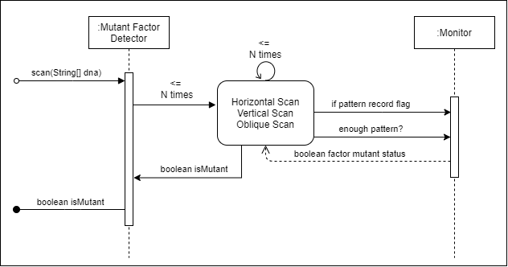

# Java Spring Boot Microservice Elasticsearch Redis Demo  

This repository contains a sample demo of very basic API REST **Mutant Detector** which receive genetic factors code and check if the DNA is mutant o no.

The solution was written Java and the Spring Boot framework, with CD/CI techniques, cloud integrations and, works with a search-oriented database engine and cached calculations, Elasticsearch and Redis.

You can know if a human is a mutant if you find more than one sequence of four letters
equal, oblique, horizontally, or vertically.

## How it works

The projects concentrate on the implementation of mutant detection solution scanning DNAs where you will receive as a parameter an array of Strings that represent each table row of **(NxN)** with the DNA sequence.

The letters of the Strings can only be: **(A, T, C, G)**, the which represents each nitrogenous base of DNA.

The next diagram shows the flow of the scan algorithm

Currently, Spring Boot application and, the Elasticsearch and Redis databases engines are running  on a single EC2 instance.

## How to run

### Prerequisites

- [Java 1.8](https://www.oracle.com/ar/java/technologies/javase/javase-jdk8-downloads.html)
- [Redis](https://redis.io/topics/quickstart)
- [Elasticsearch](https://www.elastic.co/guide/en/elasticsearch/reference/current/install-elasticsearch.html)

> Ensure that Elastic Search be running on **9200** port and Redis on port **6379**.

- The Application was setup to run on port **9901**.
- Clone this project, move inside and prepare the application
  - `git clone git@github.com:angelszymczak/java-spring-microservice-elasticserch-auth.git`
  - `cd java-spring-microservice-elasticserch-auth`
  - `mvn clean install`
- Start up microservice
  - `java -jar target/scanner-1.0.jar`

### Test it

- The API
    - Headers
        - `Content-Type: application/vnd.magneto.v1+json`
        - `X-Accept-Version: v1`
    - Authentication
        - Basic Auth: username and password **provided**
    - URL
        - `{{domain}}/v1/..`

#### POST /mutant

| Method | Path | Body | HTTP Response | Body Response|
|---     |---|---|---|---|
| **POST**   | /mutant | `{ "dna": [ (string * N) * N] }` | **200 OK/ 403 Forbidden**  |  |
| **GET**    | /stats |  | **200 OK** | `{ "mutant_dna_count": int,  "human_dna_count": int, "ratio": float }` |

- You can prove it with any REST Client like [Insomnia](https://insomnia.rest/download/)

  - Here you can find a pre configured [workspace](rest-client-insonmia-workspace.json)
   

